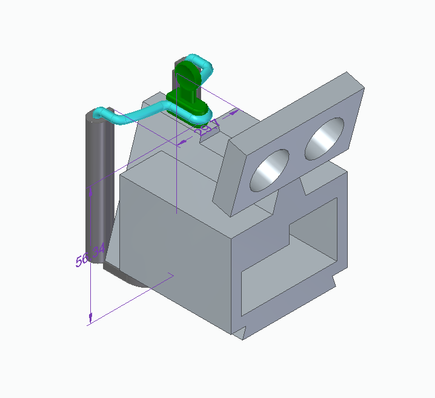

# Security System Mediated by Artificial Intelligence - SSMAI

> Sistema de segurança domiciliar utilizando inteligência artificial no reconhecimento facial para abrir portas.

Fonte: Produção dos próprios autores.

## Conteúdo
- [Introdução](#introdução)
- [Funcionamento](#funcionamento)
- [Software](#software)
	- [telegram_bot](#telegram_bot)
	- [site](#site)
	- [raspberry](#raspberry)
- [Hardware](#hardware)
	- [Componentes](#componentes)
    - [Circuito](#circuito)
- [Estrutura 3D](#estrutura-3d)
- [Demonstração](#demonstração)
- [Pitch](#pitch)
- [Agradecimentos](#agradecimentos)
- [Referências](#referências)
- [Autores](#autores)

## Introdução
Com o objetivo de produzir um trabalho que integra software e hardware para a matéria de Projeto Integrado de Computação II, os alunos da graduação do curso de Engenharia de Computação da Universidade Federal do Espírito Santo, [Gabrielly Cariman](https://github.com/gabriellybc) e [Mayke Wallace](https://github.com/Nitrox0Af), desenvolveram um projeto voltado para a área de segurança.

A ideia era construir um sistema domiciliar baseado em reconhecimento facial utilizando inteligência artificial, e, devido a isso, o grupo foi nomeado como **_Security System Mediated by Artificial Intelligence - SSMAI_**.

O trabalho foi dividido em tarefas (tasks), que tinham uma label em comum, sendo de hardware ou de software, que foram divididas pela equipe. O desenvolvimento do projeto foi organizado utilizando o Kanban do Trello, resultando em um quadro que pode ser visualizado na figura abaixo.

Fonte: Produção dos próprios autores.

## Funcionamento
O sistema é bem simples. O sensor Reed Switch monitora se a porta está fechada ou aberta. Caso a porta esteja aberta, as opções de entrar com o reconhecimento facial ou com a sequência de dígitos ficam bloqueadas até a porta voltar ao estado de fechada, pois não faria sentido tentar abrir uma porta que já está aberta. Com a porta fechada, existem duas formas de poder abri-la, como mencionado anteriormente: 1 - reconhecimento facial ou 2 - sequência de senha.

Por padrão, as senhas são de 4 dígitos e são "1234". Entretanto, existe uma terceira opção para trocar essa senha, nesse caso, o sistema irá pedir para entrar com uma senha de 8 dígitos para poder trocar a senha de 4 dígitos, "12345678".

Em caso de erro na digitação da senha correta, o sistema notificará que a senha colocada está errada, o LED vermelho piscará 3 vezes e um buzzer emitirá um som de apito por 1 segundo.

A opção de abrir a porta por reconhecimento facial é uma segunda alternativa. Ao ser selecionada, o sistema fica monitorando a distância que um rosto de uma pessoa está em relação à câmera. Ao chegar a menos de 40 cm da câmera e após 3 segundos, a câmera tirará uma foto da pessoa presente. Após a confirmação, o sistema fará o match do rosto da pessoa com os rostos presentes no banco de dados do site. Ao obter um resultado, uma mensagem será enviada para o Telegram cadastrado. Pelo Telegram, o dono do produto receberá a foto de quem está querendo abrir a porta e poderá selecionar duas opções: abrir a porta ou mantê-la fechada.

## Software

O código foi escrito em Python e pode ser encontrado em três pastas principais, cada pasta contém a explicação de como instalar e rodar os programas:

### [telegram_bot](https://github.com/Nitrox0Af/Security-System-Mediated-by-Artificial-Intelligence---SSMAI/tree/main/telegram_bot)
Nesta pasta, encontra-se o código responsável por executar um bot do Telegram para cadastro de proprietários do nosso produto. O bot foi desenvolvido usando a biblioteca [*python-telegram-bot*](https://python-telegram-bot.org/), que permite a interação com a plataforma do Telegram. Ele registra o email do proprietário e salva o Chat ID do Telegram para futuras comunicações. O sistema é executado na VM (Máquina Virtual) fornecida pela UFES (Universidade Federal do Espírito Santo), garantindo um ambiente seguro e controlado para a execução do código. Para acessar a VM, é necessário estar conectado presencialmente à rede da universidade ou utilizar uma VPN autorizada.

Na mesma VM, também está em execução o broker MQTT Mosquitto, que desempenha um papel fundamental na comunicação entre a Raspberry Pi e o site.

O funcionamento do Bot [SSMAICadatroBot](https://t.me/SSMAICadastroBot) pode ser visto abaixo.

Fonte: Produção dos próprios autores.

### [site](https://github.com/Nitrox0Af/Security-System-Mediated-by-Artificial-Intelligence---SSMAI/tree/main/site)
O site é executado na mesma VM do bot do Telegram e foi desenvolvido usando o framework [Django](https://docs.djangoproject.com/pt-br/4.2/), framework web de código aberto, escrito em Python. O projeto Django, chamado "django_ssmai", contém a aplicação "ssmai". O banco de dados utilizado é o SQLite.

No site, o primeiro passo é realiza o cadastro inicial das pessoas que adquiriram o produto, como mostrado abaixo:

Fonte: Produção dos próprios autores.

Posteriormente, as pessoas cadastradas acessam o site e se registram no bot do Telegram, conforme demonstrado abaixo, o cadastro no Bot do Telegram já foi demonstrado na seção anterior:

Fonte: Produção dos próprios autores.

Após adquirir o produto, uma Raspberry Pi é instalada na casa do proprietário e recebe as configurações necessárias. O sistema permite o cadastro de hóspedes, incluindo suas informações e fotos:

Fonte: Produção dos próprios autores.

O próprio proprietário também deve se cadastrar como hóspede, caso ele deseje usar o reconhecimento facial.

As fotos dos hóspedes são armazenadas localmente e o banco de dados SQLite contém apenas o caminho para a foto. Além disso, é gerado um encoding usando a biblioteca [*face_recognition*](https://pypi.org/project/face-recognition/), e esse encoding é salvo localmente no formato pickle, representação binária. Quando uma nova foto é adicionada, um tópico MQTT informa a Raspberry Pi, que solicita o arquivo pickle correspondente através de uma requisição ao site.

### [raspberry](https://github.com/Nitrox0Af/Security-System-Mediated-by-Artificial-Intelligence---SSMAI/tree/main/raspberry)
Nesta pasta, estão todos os códigos necessários para o funcionamento da Raspberry Pi. Alguns dos arquivos incluídos são:

- [**config.py**](https://github.com/Nitrox0Af/Security-System-Mediated-by-Artificial-Intelligence---SSMAI/blob/main/raspberry/config.py): Define todos os GPIOS da Raspberry Pi e requer que o email do proprietário seja alterado para fins de configuração.

- [**mqtt.py**](https://github.com/Nitrox0Af/Security-System-Mediated-by-Artificial-Intelligence---SSMAI/blob/main/raspberry/mqtt.py): Estabelece a conexão com o MQTT para requisição ou exclusão de encodings de pessoas cadastradas no site. Sempre fica rodando na Raspberry. Um exemplo do que acontece quando uma foto é adicionada e depois deletada no site pode ser visto abaixo. Ele faz uma requisição para o site para pegar o encoding e depois deleta esse encoding, quando recebe pelo MQTT que a foto foi deletada.

 Fonte: Produção dos próprios autores.

- [**main.py**](https://github.com/Nitrox0Af/Security-System-Mediated-by-Artificial-Intelligence---SSMAI/blob/main/raspberry/main.py): Responsável por fazer a interface com a pessoa que deseja entrar na casa e determinar se o acesso será concedido por reconhecimento facial ou senha. Sempre fica rodando na Raspberry.

- [**gate.py**](https://github.com/Nitrox0Af/Security-System-Mediated-by-Artificial-Intelligence---SSMAI/blob/main/raspberry/gate.py): Controla a abertura da porta quando uma pessoa é autorizada a entrar.

- [**keyboard.py**](https://github.com/Nitrox0Af/Security-System-Mediated-by-Artificial-Intelligence---SSMAI/blob/main/raspberry/keyboard.py): Realiza a interação com o teclado para capturar as teclas pressionadas.

- [**photo_capture.py**](https://github.com/Nitrox0Af/Security-System-Mediated-by-Artificial-Intelligence---SSMAI/blob/main/raspberry/photo_capture.py): Responsável por tirar fotos das pessoas e mostrar a imagem capturada.

- [**recognizer.py**](https://github.com/Nitrox0Af/Security-System-Mediated-by-Artificial-Intelligence---SSMAI/blob/main/raspberry/recognizer.py): Gera o encoding da imagem da pessoa e compara com os encodings armazenados na Raspberry Pi, que foram requisitados do site. Além disso, interage com o bot do Telegram definido no arquivo [**telegram_bot.py**](https://github.com/Nitrox0Af/Security-System-Mediated-by-Artificial-Intelligence---SSMAI/blob/main/raspberry/telegram_bot.py), enviando a foto da pessoa que deseja entrar e perguntando se o proprietário deseja permitir o acesso, como pode ser visto a seguir.

 Fonte: Produção dos próprios autores.

- [**reed.py**](https://github.com/Nitrox0Af/Security-System-Mediated-by-Artificial-Intelligence---SSMAI/blob/main/raspberry/reed.py): Responsável por obter leituras do sensor magnético reed.

No monitor externo, localizado do lado de fora da casa, é exibido um menu inicial para que as pessoas que desejam entrar possam fazer suas escolhas facilmente. O menu apresenta as seguintes opções, como mostrado na figura abaixo:

Fonte: Produção dos próprios autores.

## Hardware

### Componentes
- 01 Piezo Buzzer
- 01 LED vermelho
- 01 LED verde
- Resistores
    - 2x 330 Ω
    - 4x 1k Ω
    - 1x 10k Ω
- 01 Raspberry Pi 3 B+ (Raspberry OS 64-bit)
- 01 Transistor TIP42C
- 01 Transistor TIP31C
- Jumpers
- 01 Reed Switch
- 01 Ímã
- 01 Maquete de porta eletrônica
- 01 Câmera
- 01 Ultrassom
- 01 Monitor
- 01 Protoboard

### Circuito

Em uma primeira etapa, foi desenvolvida uma placa de circuito impresso com a finalidade de conter todos os componentes soldados à placa e suas respectivas conexões, conforme pode ser observado na imagem abaixo.

Fonte: Produção dos próprios autores.

Entretanto, após realizar todas as conexões e procedimentos de soldagem, o primeiro teste utilizando essa placa desenvolvida resultou em falha.

Diante disso, a protoboard foi utilizada para realizar todas as ligações de forma mais flexível. Assim, foi possível obter o circuito desejado e funcional, que agora pode ser visualizado na imagem abaixo.

Fonte: Produção dos próprios autores.

Os pinos GPIOs da Raspberry são uma interface física entre a Raspberry Pi e o mundo exterior. No nível mais simples, é possível pensar neles como interruptores que podem ser ligar ou desligar (entrada) ou que a Raspberry pode ligar ou desligar (saída).

Os pinos GPIO permitem que a Raspberry Pi controle e monitore o mundo exterior ao ser conectado a circuitos eletrônicos. 

A identificação de para que cada pino da Raspberry é usado pode ser vista abaixo.

Fonte: Warwick et al.

**Pinos**
- 3V3: Qualquer coisa conectada a esses pinos sempre receberá 3,3V de energia

- 5V: 	Qualquer coisa conectada a esses pinos sempre receberá 5V de energia

- GND: "Zero" volts, terra, usado como a referência para o circuito

- GPIO N: Esses pinos são para uso geral e podem ser configurados como pinos de entrada ou saída

**Conexões dos LEDs**

As conexões dos LEDs foram feitas de forma parecida com a da imagem abaixo. Porém, foram usados resistores de 330 Ω o LED verde foi conectado ao GPIO 22 e o LED vermelho realmente foi conectado no GPIO 17.

Fonte: FOUNDATION. Lighting an LED.

Os LEDs foram usados para sinalizar se a porta deveria ficar fechada ou aberta.

**Conexão do Buzzer**

A conexão do Buzzer foi feita de forma parecida com a da imagem abaixo. Porém, o Buzzer foi conectado ao GPIO 21.

Fonte: FOUNDATION. Using a buzzer.

O Buzzer foi usado para sinalizar quando a porta deveria ficar fechada e uma pessoa errava a senha ou não era reconhecida, por exemplo.

**Conexão do Sensor de Distância Ultrassônico**

A conexão do Sensor de Distância Ultrassônico foi feita de forma parecida com a da imagem abaixo. Porém, foram usados resistores de 330 Ω  e 1k Ω para o divisor de tensão e o ECHO do Sensor de Distância Ultrassônico foi conectado ao GPIO 27 e o TRIG realmente foi conectado ao GPIO 4.

Fonte: FOUNDATION. Using an ultrasonic distance sensor.

O sensor Ultrassônico foi utilizado após uma pessoa selecionar que queria entrar usando o reconhecimento facial, ele verifica se a pessoa estava a pelo menos 40 cm de distância, para iniciar o processo de reconhecimento.

**Conexão do Sensor Reed Switch**

A conexão do Sensor Reed Switch, sensor eletromecânico usado para detectar a presença ou ausência de um campo magnético, foi feita de forma parecida com a da imagem abaixo. Porém, ele foi conectado ao GPIO 18.

Fonte: FAHAD. (2020).

Esse sensor foi usado para identificar se a porta estava aberta ou fechada. Para que ele funcionasse corretamente, também foi colado, na parte móvel da porta, um imã para gerar o campo magnético.

As conexões dos outros componentes seguiram de forma semelhante. Conectando resistores, transistores, alimentação e GND de forma necessária para que o circuito funcione corretamente.

**Abertura da tranca**

A porta tem um sistema automatico de fechadura, uma solenoide que abre se for alimentada com 12V a 700mA. Dito isso, foi pensado de primeiro usar um relé para controle da energia da porta, entretanto, os pinos do relé não era compatível com a placa de ensaio, assim, pensou-se num cicuito que funcionase como uma chave, e com isso em mente criou-se o circuito a baixo.

Fonte: Produção dos próprios autores.

O circuito é simples, usando um tip31C e um tip42C cascateados(par Darlington), constroi-se uma configuração de chave, onde: quando tem-se a vontade de abrir a porta é mandado um sinal LOW na base do do transistor NPN ou um HIGH caso contrário.

## Estrutura 3D

Foram desenvolvidas estruturas 3D que posteriormente foram impressas na impressora 3D. Essas estruturas foram projetadas para fornecer suporte e estabilidade a todo o nosso projeto.

A primeira estrutura 3D criada foi um suporte para a webcam e o sensor ultrassom, posicionado logo acima dela, conforme mostrado na imagem abaixo.

    
    

Fonte: Produção dos próprios autores.

A segunda estrutura 3D consistiu em uma caixa desenvolvida para abrigar todo o nosso hardware, principlamente a protoboard, proporcionando proteção e organização, conforme ilustrado na imagem abaixo.

    
    

Fonte: Produção dos próprios autores.

Essas estruturas impressas desempenham um papel essencial na configuração física e funcionalidade do nosso projeto, garantindo que todos os componentes estejam devidamente posicionados e protegidos.

## Demonstração 
> Clique na imagem abaixo, para ver um vídeo da explicação do produto final.

## Pitch 
> Clique na imagem abaixo, para visualizar o Pitch do projeto.

## Agradecimentos
Gostaríamos de fazer menção à Equipe de Robótica da UFES (ERUS) e ao Software Defined Networks Research Group (NERDS) por nos emprestar várias ferramentas, componentes para o desenvolvimento do trabalho e espaço físico. Agradecemos também aos professores [Ricardo Carminati de Mello](http://lattes.cnpq.br/1569638571582691) e [Rodolfo da Silva Villaca](http://lattes.cnpq.br/3755692723547807), responsáveis pela disiciplina Projeto Integrado de Computação II no semestre de 2023/1, por esclarecerem muitas de nossas dúvidas e nos encaminharem para as pessoas certas. Um agradecimento especial ao Fernando, atual membro da ERUS, por disponibilizar tempo para imprimir nossos modelos 3D.

Agradecemos a todos que contribuíram para este projeto!

|  |  |  |
|:-----------------------:|:-----------------------:|:-----------------------:|

## Referências

- [WARWICK, T.; MESER, R.; WOJCIAKOWSKI, M.; CLAY, S. Raspberry Pi 2 & 3 Pin Mappings. Microsoft Learn.](https://learn.microsoft.com/en-us/windows/iot-core/learn-about-hardware/pinmappings/pinmappingsrpi)

- [FOUNDATION, R. P. Lighting an LED.](https://projects.raspberrypi.org/en/projects/physical-computing/2)

- [FOUNDATION, R. P. Using a buzzer.](https://projects.raspberrypi.org/en/projects/physical-computing/8)

- [FOUNDATION, R. P. Using an ultrasonic distance sensor.](https://projects.raspberrypi.org/en/projects/physical-computing/12)

- [FAHAD, S. (2020). Reed Switch with Raspberry Pi, interfacing and Python Programming.](https://www.electroniclinic.com/reed-switch-with-raspberry-pi-interfacing-and-python-programming/)

- [PATEL, R. Raspberry Pi Pico and 4x3 Keypad.](https://www.instructables.com/Raspberry-Pi-Pico-and-4x3-Keypad/2)

## Autores

| [ Gabrielly Cariman](https://www.linkedin.com/in/gabrielly-barcelos-cariman) | [ Mayke Wallace](https://www.linkedin.com/in/mayke-wallace-silva-alves) 
| :------------------------------------------------------------------------------------------------------------------------------: | :----------------------------------------------------------------------------------------------------------------------------------: 

